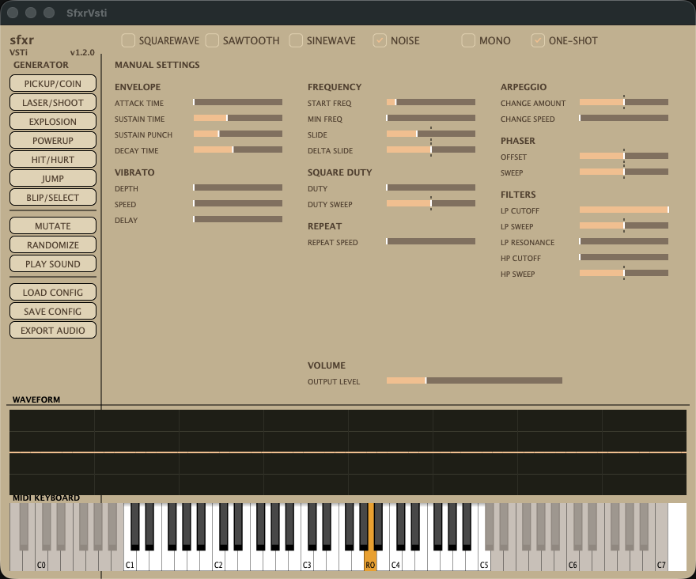

# SfxrVsti



A JUCE instrument plugin built on the [sfxr](http://www.drpetter.se/project_sfxr.html) synthesis algorithm (DrPetter, 2007). It turns the classic "sound effect generator" into a polyphonic, DAW-automatable VST3 / AU / Standalone plugin with an on-screen MIDI keyboard.

> [中文文档](README.md) · [User Manual](docs/user-manual.en.md) / [用户手册](docs/user-manual.md)

## Features

- **Faithful port** of the sfxr 1.2.1 synthesis core (square/sawtooth/sine/noise + LP/HP filters + phaser + 8x supersampling + repeat + arpeggio)
- **Polyphonic**: 8 voices, with a switchable MONO mode
- **MIDI transposition**: note 69 is the root and plays the "Start Frequency" knob's value unmodified; other notes transpose in semitones (the root's actual pitch is set by Start Frequency — it is not a 440 Hz concert A)
- **Two trigger modes**: One-Shot (default, plays to completion) and Sustain (holds until note-off)
- **All 24 sfxr parameters** are exposed to the host (note: parameters are latched at note-on, as in the original sfxr, so automation does not alter a note that is already sounding)
- **Classic sfxr look**: beige/orange sliders, 7 preset generators + RANDOMIZE / MUTATE
- **On-screen MIDI keyboard** (full 88 keys, keys outside the usable range greyed out, root note highlighted) + real-time waveform oscilloscope
- **.sfs file compatibility**: reads/writes the original sfxr parameter files (version 102), with parameters kept as continuous floats rather than quantised
- **8 factory programs**: Init plus one per generator category, exposed in the host's preset menu (deterministic -- the same program always gives the same sound)

## Directory structure

```
sfxr-vsti/
├── CMakeLists.txt          # build config (FetchContent pulls in JUCE)
├── Source/
│   ├── PluginProcessor.*   # parameter tree, MIDI dispatch, scope buffer
│   ├── PluginEditor.*      # GUI (sliders, keyboard, scope, preset buttons)
│   └── SfxrEngine/
│       ├── SfxrParams.h    # parameter definitions (IDs + struct)
│       ├── SfxrVoice.*     # synthesis core (ResetSample/SynthSample port)
│       ├── SfxrEngine.*    # 8-voice pool, MONO, note dispatch
│       ├── SfxrPresets.*   # 7 generators + RANDOMIZE + MUTATE
│       └── SfxrPresetFile.*# .sfs file read/write
├── tests/RenderTest.cpp    # offline render test (DSP verification)
├── scripts/build.sh        # build script (macOS/Linux)
├── scripts/build_windows.bat # build script (Windows)
└── reference/              # upstream sfxr-sdl-1.2.1 source (gitignored)
```

## Download

Download pre-built binaries for your platform from [GitHub Releases](../../releases) (built automatically by GitHub Actions):

| Platform | File | Formats |
|----------|------|---------|
| macOS | `SfxrVsti-macOS.zip` | VST3 + AU + Standalone |
| Windows | `SfxrVsti-Windows.zip` | VST3 + Standalone |
| Linux | `SfxrVsti-Linux.zip` | VST3 + Standalone |

## Installing

### macOS

Extract and copy to the user plugin folders:

- VST3 → `~/Library/Audio/Plug-Ins/VST3/`
- AU → `~/Library/Audio/Plug-Ins/Components/`

### Windows

Copy the `.vst3` to `C:\Program Files\Common Files\VST3\` (requires Administrator privileges).

### Linux

Copy the `.vst3` to `~/.vst3/`.

## Building from source

Requirements: CMake 3.24+, a C++17 compiler. JUCE 8.0.15 is downloaded automatically by CMake's `FetchContent` at configure time (network required).

macOS / Linux:

```bash
./scripts/build.sh
```

Windows:

```bat
scripts\build_windows.bat
```

Or manually:

```bash
cmake -B build -DCMAKE_BUILD_TYPE=Release
cmake --build build --parallel
```

### Artifacts per platform

| Platform | Formats | Output |
|----------|---------|--------|
| macOS | VST3 + AU + Standalone | `build/SfxrVsti_artefacts/Release/` |
| Windows | VST3 + Standalone | `build/SfxrVsti_artefacts/Release/` |
| Linux | VST3 + Standalone | `build/SfxrVsti_artefacts/Release/` |

Windows requires MSVC or MinGW; Linux requires the ALSA/JACK/X11 development libraries (see the full dependency list in `.github/workflows/build.yml`).

## Usage

### Interface

- **GENERATOR column** (left): 7 preset categories (PICKUP/COIN, LASER/SHOOT, EXPLOSION, POWERUP, HIT/HURT, JUMP, BLIP/SELECT) + PLAY SOUND / RANDOMIZE / MUTATE / LOAD SOUND / SAVE SOUND
- **MANUAL SETTINGS** (right): all parameters grouped under ENVELOPE / FREQUENCY / VIBRATO / SQUARE DUTY / REPEAT / ARPEGGIO / PHASER / FILTERS
- **Waveform oscilloscope** (bottom): live output waveform
- **Virtual keyboard** (bottom): 88 keys, click/drag to play; the root note (69) is highlighted in orange and labelled ROOT; keys outside C2–C6 are greyed out and do not respond

### Valid note range

The synth is rooted at note 69; other notes transpose by `2^(-(note-69)/12)`. The root's own frequency depends on **Start Frequency** (about 321 Hz at the default of 0.3), so the note names on the keyboard are positional landmarks rather than concert pitches.

The trigger range is **C2-C6 (MIDI 36-84)**. Notes outside it are greyed out on screen, ignore mouse clicks, and incoming DAW MIDI is ignored as well, so the UI and the host behave identically.

This is a usable-range convention rather than a technical boundary: pitch is transposed relative to START FREQ, so the actual frequency of a given MIDI note depends on that parameter. At the default of 0.3, C2 is about 48 Hz and C6 about 764 Hz.

### Parameters

| Parameter | Range | Description |
|-----------|-------|-------------|
| Waveform | Square/Saw/Sine/Noise | base waveform |
| Attack / Sustain / Punch / Decay Time | 0–1 | volume envelope |
| Start Frequency | 0–1 | start pitch (note 69 plays this value) |
| Min Frequency | 0–1 | lower pitch limit (stops when a downward slide reaches it) |
| Slide / Delta Slide | -1–1 | pitch slide / rate of slide change |
| Vibrato Depth / Speed / Delay | 0–1 | vibrato |
| Change Amount / Speed | -1–1 / 0–1 | arpeggio (pitch jump after a delay) |
| Square Duty / Duty Sweep | 0–1 / -1–1 | square duty cycle and its sweep |
| Repeat Speed | 0–1 | periodic re-trigger of frequency/duty |
| Phaser Offset / Sweep | -1–1 | phaser (delayed overlay) |
| LP Cutoff / Sweep / Resonance | 0–1 / -1–1 / 0–1 | low-pass filter |
| HP Cutoff / Sweep | 0–1 / -1–1 | high-pass filter |
| Output Level | 0–1 | output volume |
| Mono | toggle | mono mode (new note re-triggers) |
| One-Shot | toggle | off = Sustain (note holds) |

## Architecture & porting notes

The synthesis core `SfxrVoice` is a line-by-line port of the original `ResetSample()` and `SynthSample()` (see `reference/sfxr-sdl-1.2.1/main.cpp`), with these changes:

- **Sample-rate independence**: every constant in the original is calibrated for 44100 Hz, so each is rescaled according to its dimension (lengths x `sr/44100`, first-order rates / `sr/44100`, second-order rates / `(sr/44100)^2`). This covers pitch, slides, duty sweep, filter coefficients and sweeps, vibrato, envelopes, repeat, arpeggio and the phaser delay. `tests/RenderTest.cpp` verifies each one at 44.1/48/88.2/96/192 kHz
- **MIDI transposition**: `fperiod *= 2^(-(note-69)/12)`, with note 69 matching the original parameters
- **Polyphonic state**: the original globals were moved into per-voice fields
- **Velocity**: MIDI velocity scales the output gain
- **`vib_delay` implemented**: the original never used this parameter; it now fades the vibrato in after a delay
- **Sustain mode**: when One-Shot is off, the note holds in the Sustain stage until note-off
- **Guarded envelope division**: a zero-length stage divided by zero in the original, emitting a NaN. Harmless when writing a WAV file, not when feeding a DAW bus. Guarding the division rather than padding the length keeps non-degenerate sounds sample-for-sample identical to the original (97% bit-identical at 44.1 kHz, max deviation 8.5e-07, purely from computing coefficients in double)

## Testing

`tests/RenderTest.cpp` is an asserting offline test suite that needs no host. CI runs it on every build:

```bash
cmake --build build
ctest --test-dir build --output-on-failure
```

It covers:

- Pitch, envelope duration, vibrato rate, frequency slide and duty sweep must be **identical at 44.1 / 48 / 88.2 / 96 / 192 kHz** (all of these constants are calibrated for 44100 Hz in the original)
- MIDI transposition follows equal temperament (+/-1 octave, +7 semitones)
- A sweep of 692 parameter sets across all 7 preset generators plus randomize/mutate, asserting the output **never contains NaN/Inf and never exceeds the 0 dBFS clamp**
- Out-of-domain folding is **bit-identical** to the original (parameters the synth squares render exactly the same after abs()), and 10850 generated parameter sets all land inside the domain
- Output level matches the original WAV export and scales linearly with Output Level
- One-shot notes end by themselves; sustained notes hold until note-off
- `.sfs` files round-trip; truncated files and unknown versions are rejected

## License

This project is licensed under the **GNU Affero General Public License v3 (AGPLv3)**. The synthesis engine is ported from [sfxr](http://www.drpetter.se/project_sfxr.html), whose MIT license notice is preserved.

- Full license text: [LICENSE](LICENSE)
- Third-party notices: [THIRD_PARTY_NOTICES.md](THIRD_PARTY_NOTICES.md)
